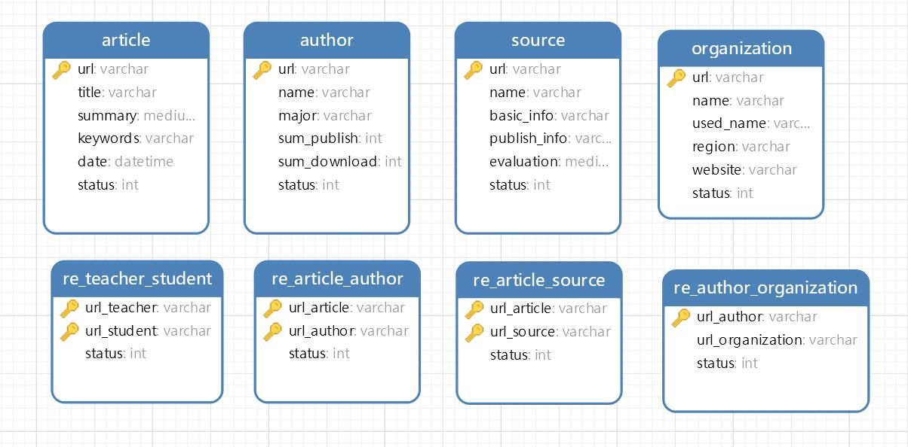
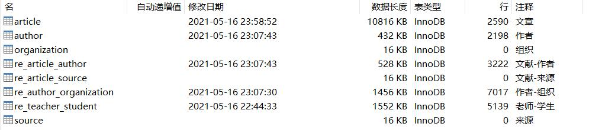
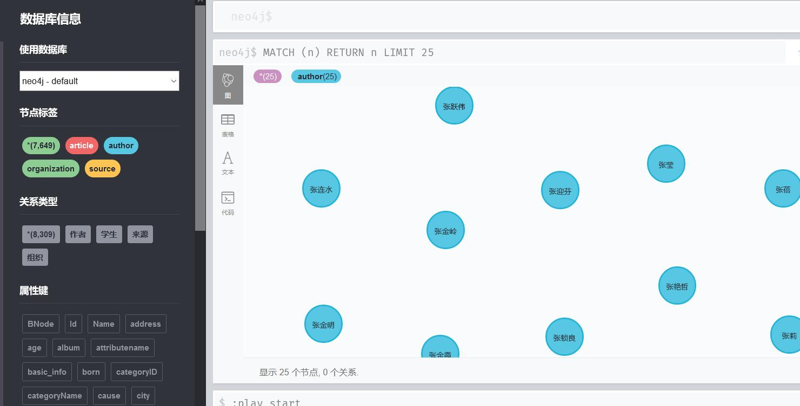
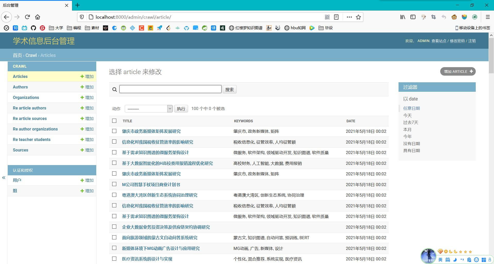

# 开发过程

本文档用于记录开发过程

**5.12**

- 爬虫：知网关键词检索页
- 期刊-作者url，期刊-来源url存储到了mysql
- 期刊-发布日期，存储到了redis

---

**5.13**

- 爬虫：文章，来源
- 更新MySQL数据

---

**5.14**

- 爬虫基本完成
- MySQL爬取到的数据
  
  

**5.15**

- 重构mysql数据库结构（以url作为主键）

  

- 更新爬虫代码，爬取一小部分数据

---

**5.16**

- 构建知识图谱
- 爬取河北大学相关数据
  
- 构建知识图谱（文章，作者节点）

---

**5.17**

- 构建知识图谱

  

- 后台管理系统

  

**5.18**

- 学习django（官方案例：polls）
- 做毕设PPT
